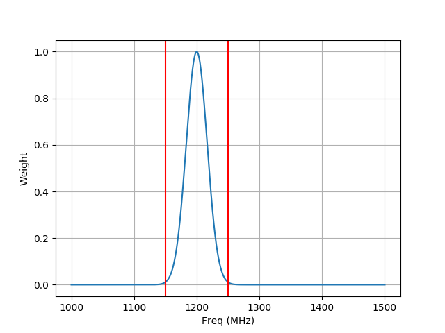

1. create a weight file in freq
 - Usage: start_freq and end_freq in MHz
> python bandspec.py 1150 1250

2. create a binary file
  > cd OPTIMUS
  > make

3. simulate the file
  > OPTIMUS/simulateSimplePsr_mcc -p parmas/FAST_19Beam.params -p params/test_DM_300_P0_0.0007236s.params -o test_DM_300_P0_0.0007236s.dat

Example:

> name: J1950+30
> p0: 1.610612736
> dm: 565
> raj: 4.510914803
> decj: 0.136026590
> flux: 0.1
> width: 0.007893

This example will simulate a single pulse with pulse width equals to `1.610612736*0.007893=0.012712566325248 sec (P0*width)`

 

4. combine the simulation data and backend file
    python simMultiPsr.py simulateFRB1000bursts.yaml       (MiaoCC)
    python simMultiPsr_RMS.py simulateFRB1000bursts.yaml   (WangPei)

5. plot for checking the simulating results
    DM=565
    P=1.6s
    simBinaryData length = 4 sec

python getScale.py simulate.yaml
